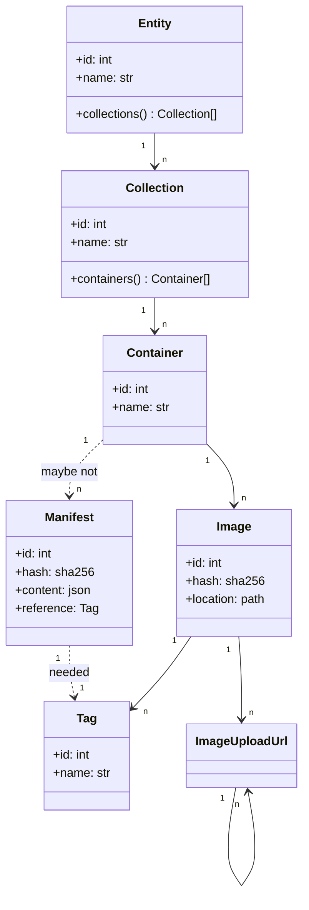

# Data Model

```mermaid
classDiagram
  Entity "1" --> "n" Collection
  Collection "1" --> "n" Container
  Container "1" ..> "n" Manifest : maybe not 
  Container "1" --> "n" Image
  Image "1" --> "n" Tag
  Image "1" --> "n" ImageUploadUrl
  ImageUploadUrl "1" --> "n" ImageUploadUrl
  Manifest "1" ..> "1" Tag : needed

  class Entity {
    +id: int
    +name: str
    +collections() Collection[]
  }
  class Collection {
    +id: int
    +name: str
    +containers() Container[]
  }
  class Container {
    +id: int
    +name: str
  }
  class Image {
    +id: int
    +hash: sha256
    +location: path
  }
  class Tag {
    +id: int
    +name: str
  }
  class Manifest {
    +id: int
    +hash: sha256
    +content: json
    +reference: Tag
  }
```